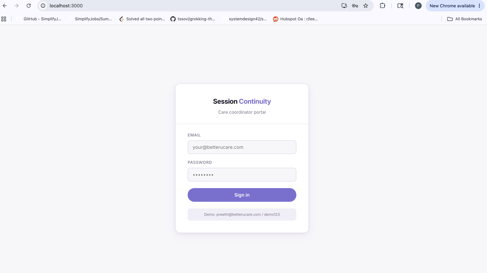
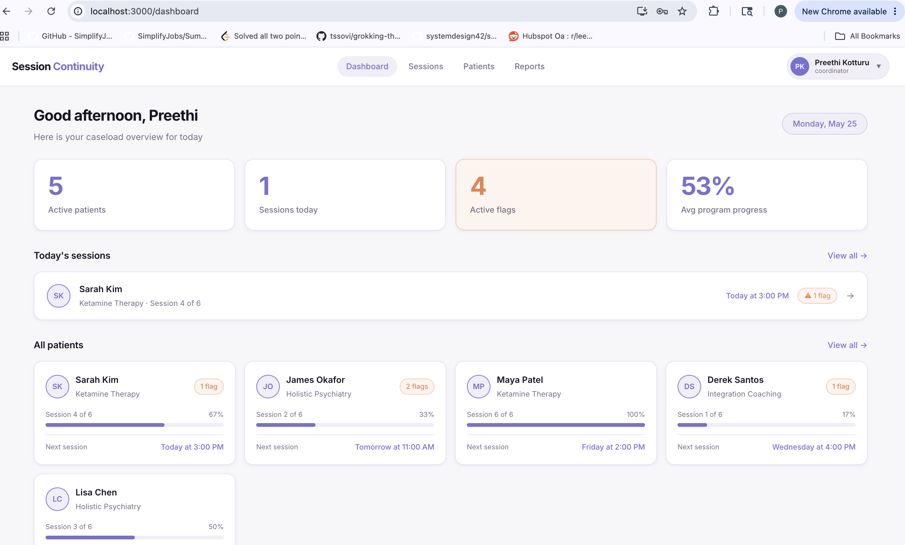
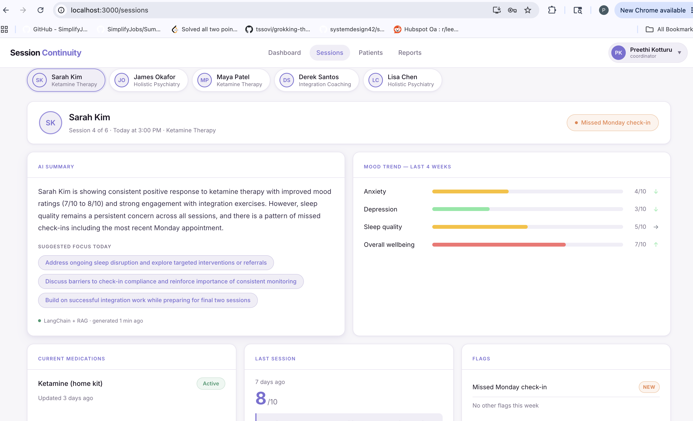
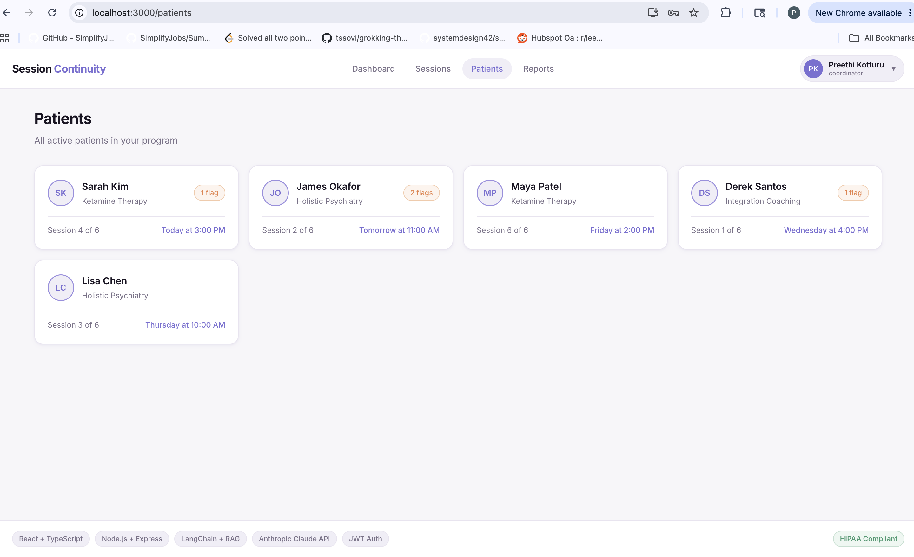
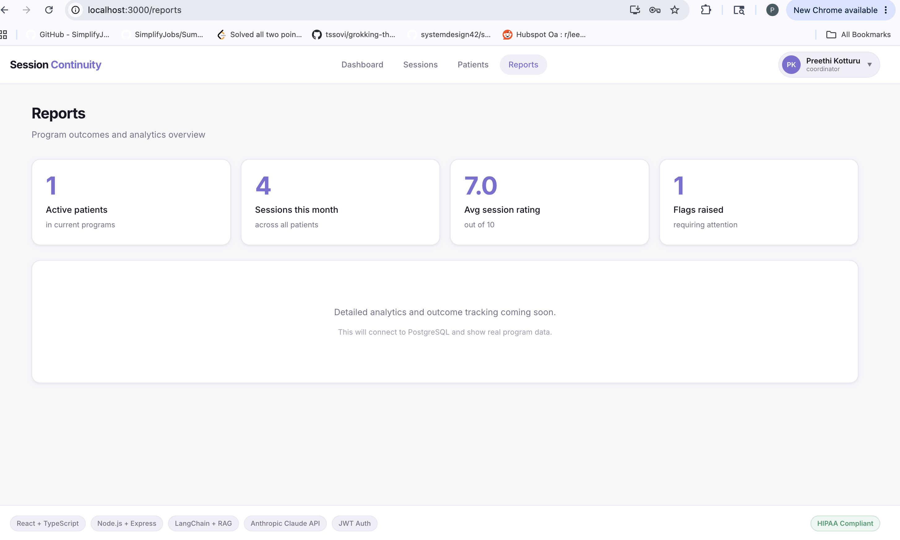
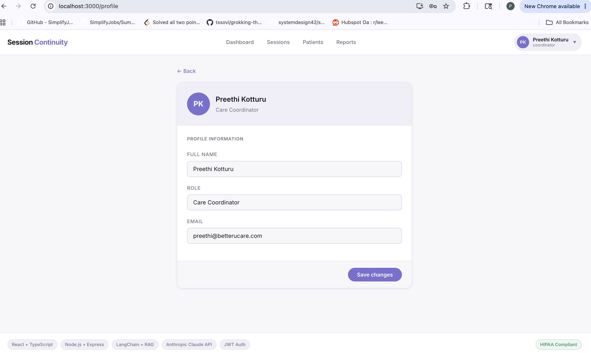
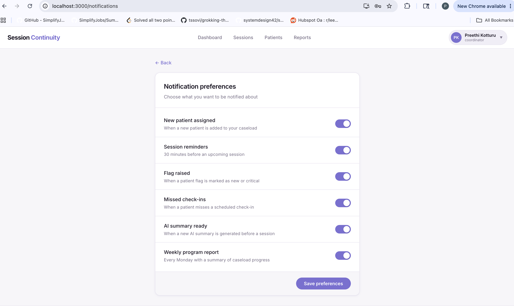

# Session Continuity Dashboard

> An AI-powered care coordinator dashboard built for **Better U** — giving coordinators a complete picture of each patient before every session starts.

**The coordinator walks in already knowing the patient. The patient feels that in the first 30 seconds.**

---

## Live Demo

🔗 **[session-continuity-dashboard.vercel.app](https://session-continuity-dashboard.vercel.app)**

**Demo login:**
```
Email:    preethi@betterucare.com
Password: demo123
```

> Note: The backend runs on Render's free tier and may take 30–60 seconds to wake up on first login. If login fails, wait a moment and try again.

---

## Screenshots

### Login


### Dashboard — Caseload Overview


### Sessions — AI Summary + Mood Trends


### Patient List


### Reports & Analytics


### Profile Settings


### Notification Settings


---

## System Design

### High Level Architecture

```
┌──────────────────────────────────────────────────────────────┐
│                         CLIENT                               │
│            React 18 + TypeScript + CSS Modules               │
│       React Router v6  ·  Axios  ·  JWT in localStorage      │
└──────────────────────────┬───────────────────────────────────┘
                           │  HTTPS · Authorization: Bearer <token>
                           ▼
┌──────────────────────────────────────────────────────────────┐
│                        API LAYER                             │
│                   Node.js + Express                          │
│    JWT middleware  ·  Role-based access  ·  Helmet + CORS    │
└──────────┬────────────────────────────────┬──────────────────┘
           │                                │
           ▼                                ▼
┌──────────────────┐          ┌─────────────────────────────────┐
│   DATA STORE     │          │        RAG PIPELINE             │
│  (PostgreSQL     │          │         (LangChain.js)          │
│  in production)  │          │                                 │
│                  │          │  1. Session notes → Documents   │
│  · Patients      │          │  2. TF-IDF local embeddings     │
│  · Sessions      │          │  3. Cosine similarity search    │
│  · Mood data     │          │  4. Top 3 docs retrieved        │
│  · Medications   │          │  5. LangChain RunnableSequence  │
│  · Flags         │          │  6. Claude Sonnet generates     │
└──────────────────┘          │     clinical summary            │
                              └──────────────┬──────────────────┘
                                             │
                                             ▼
                              ┌─────────────────────────────────┐
                              │      Anthropic Claude API       │
                              │       claude-sonnet-4-5         │
                              └─────────────────────────────────┘
```

### RAG Pipeline — How the AI Summary Works

```
  Patient Session History
              │
              ▼
  ┌───────────────────────┐
  │  LangChain Documents  │  Each session note + mood data
  │                       │  becomes a Document object
  └──────────┬────────────┘
             │
             ▼
  ┌───────────────────────┐
  │  TF-IDF Embeddings    │  Each document converted to
  │  (SimpleVectorStore)  │  a normalised numerical vector
  └──────────┬────────────┘
             │
             ▼
  ┌───────────────────────┐
  │  Similarity Search    │  Semantic query retrieves
  │  (cosine distance)    │  top 3 most relevant docs
  └──────────┬────────────┘
             │
             ▼
  ┌───────────────────────┐
  │  LangChain            │  Retrieved context injected
  │  PromptTemplate +     │  into clinical prompt template
  │  RunnableSequence     │
  └──────────┬────────────┘
             │
             ▼
  ┌───────────────────────┐
  │  Anthropic Claude     │  Generates:
  │  claude-sonnet-4-5    │  · 2-3 sentence summary
  │                       │  · 3 suggested focus areas
  └──────────┬────────────┘
             │
             ▼
  ┌───────────────────────┐
  │  In-memory cache      │  5 min TTL
  │  (Redis in prod)      │  Coordinator never waits twice
  └───────────────────────┘
```

### Authentication Flow

```
  POST /api/v1/auth/login
              │
              ▼
  bcrypt.compare(password, hash)
              │
              ▼
  jwt.sign({ id, email, role })
  HS256 · expires 8h
              │
              ▼
  Token stored in localStorage
              │
              ▼
  Axios interceptor attaches
  Authorization: Bearer <token>
  to every API request
              │
              ▼
  authenticate() middleware
  verifies token on every
  protected route → 401 if invalid
```

---

## How It Works

### For the Care Coordinator

1. **Sign in** : JWT issued, valid 8 hours
2. **Dashboard** : live caseload overview with sessions today, active flags, program progress per patient
3. **Sessions** : select any patient to see their full pre-session briefing:
   - **AI Summary** : LangChain RAG pipeline retrieves the most clinically relevant session notes via semantic search and feeds them to Claude Sonnet for a personalised briefing
   - **Mood Trends** : anxiety, depression, sleep quality, and wellbeing tracked over 4 weeks with trend indicators
   - **Current Medications** : active prescriptions and status
   - **Last Session** : rating out of 10 and coordinator notes
   - **Flags** : anything requiring attention before the session
   - **Suggested focus areas** : AI-generated based on patient history
4. **Patients** : full caseload list with program and next session info
5. **Reports** : program-level metrics and outcomes overview
6. **Profile** : edit name and role, persists across sessions
7. **Notifications** : toggle alert preferences
8. **Sign out** : JWT cleared, session ended

### For the Engineer

The AI summary uses a genuine **LangChain RAG pipeline**:

- Each patient's session history is converted into `LangChain Document` objects
- Documents are embedded using TF-IDF vectors (production would use Anthropic `voyage-3` via pgvector)
- Stored in a `SimpleVectorStore` with cosine similarity search
- At generation time, a semantic search retrieves the **3 most relevant** session notes, not just the most recent
- Retrieved documents are injected into a `PromptTemplate` and run through a `RunnableSequence` chain
- Claude Sonnet generates a clinical briefing: 2-3 sentence summary + 3 suggested focus areas
- Result cached in-memory for 5 minutes (Redis in production)

---

## Tech Stack

| Layer | Technology |
|---|---|
| Frontend | React 18 + TypeScript |
| Routing | React Router v6 |
| HTTP | Axios with JWT interceptor |
| Styling | CSS Modules |
| Backend | Node.js + Express |
| AI / RAG | LangChain.js: RunnableSequence, PromptTemplate |
| LLM | Anthropic Claude (claude-sonnet-4-5) |
| Embeddings | TF-IDF local (voyage-3 in production) |
| Vector store | In-memory (pgvector + PostgreSQL in production) |
| Cache | In-memory Map (Redis in production) |
| Auth | JWT : jsonwebtoken + bcryptjs |
| Security | Helmet.js, CORS, role-based middleware |
| Frontend deploy | Vercel |
| Backend deploy | Render |

---

## Project Structure

```
session-continuity-dashboard/
├── README.md
├── screenshots/
├── frontend/
│   └── src/
│       ├── api/
│       │   └── patientApi.ts           # Axios client + JWT interceptor + authApi
│       ├── components/
│       │   ├── layout/
│       │   │   ├── Navbar.tsx           # Sticky nav + profile dropdown
│       │   │   └── Footer.tsx           # Tech stack pills
│       │   ├── dashboard/
│       │   │   ├── SessionDashboard.tsx # Patient tabs + orchestration
│       │   │   ├── PatientHeader.tsx    # Name + flag badge
│       │   │   ├── AISummaryCard.tsx    # LangChain RAG summary display
│       │   │   ├── MoodTrendCard.tsx    # Animated mood bars + trends
│       │   │   ├── MedicationsCard.tsx  # Current medications
│       │   │   ├── LastSessionCard.tsx  # Rating + session notes
│       │   │   └── FlagsCard.tsx        # Active flags
│       │   └── pages/
│       │       ├── DashboardPage.tsx    # Caseload overview + stats
│       │       ├── PatientsPage.tsx     # Full patient list
│       │       ├── ReportsPage.tsx      # Program analytics
│       │       ├── ProfilePage.tsx      # Edit profile
│       │       ├── NotificationsPage.tsx# Notification toggles
│       │       └── LoginPage.tsx        # JWT login form
│       ├── hooks/
│       │   └── usePatient.ts           # Data fetching + loading/error state
│       ├── types/
│       │   └── patient.ts              # TypeScript interfaces
│       └── styles/
│           └── globals.css             # CSS variables + animations
└── backend/
    └── src/
        └── server.js                   # Express + LangChain RAG + JWT auth
```

---

## Running Locally

### Prerequisites

- Node.js 18+
- Anthropic API key → [console.anthropic.com](https://console.anthropic.com)

### Backend

```bash
cd backend
npm install
```

Create `backend/.env`:

```
ANTHROPIC_API_KEY=sk-ant-your-key-here
PORT=3001
FRONTEND_URL=http://localhost:3000
JWT_SECRET=your-secret-here
```

```bash
npm run dev
# API running at http://localhost:3001
```

### Frontend

```bash
cd frontend
npm install
npm start
# Dashboard at http://localhost:3000
```

---

## API Reference

| Method | Endpoint | Auth | Description |
|---|---|---|---|
| POST | `/api/v1/auth/login` | Public | Login → JWT token |
| POST | `/api/v1/auth/logout` | Public | Logout |
| GET | `/api/v1/auth/me` | JWT | Current user |
| GET | `/api/v1/patients` | JWT + coordinator | All patients |
| GET | `/api/v1/patients/:id/summary` | JWT + coordinator | Full summary + AI |
| GET | `/api/v1/patients/:id/mood` | JWT + coordinator | Mood trends only |
| GET | `/api/v1/patients/:id/ai-summary` | JWT + coordinator | AI summary only |
| POST | `/api/v1/patients/:id/rebuild-index` | JWT + coordinator | Rebuild vector store |

---

## Security

- JWT tokens signed with HS256, expire in 8 hours
- Passwords hashed with bcrypt
- Role-based middleware : coordinator access only on all patient routes
- Helmet.js security headers on all responses
- CORS restricted to known frontend origin
- Expired or invalid token automatically redirects to login

---

## Production Roadmap

| Current Demo | Production |
|---|---|
| In-memory patient data | PostgreSQL |
| TF-IDF local embeddings | Anthropic voyage-3 + pgvector |
| In-memory cache (JS Map) | Redis : 5 min TTL |
| Single coordinator user | Full user management + RBAC |
| Simulated notifications | Email / SMS via AWS SES + SNS |
| Render free tier | AWS ECS + CloudFront |

---

## Deployment

- **Frontend:** Vercel — [session-continuity-dashboard.vercel.app](https://session-continuity-dashboard.vercel.app)
- **Backend:** Render — [session-continuity-api.onrender.com](https://session-continuity-api.onrender.com/health)

---

*Built by **Preethi Kotturu** as a demonstration for Better U's engineering team.*
