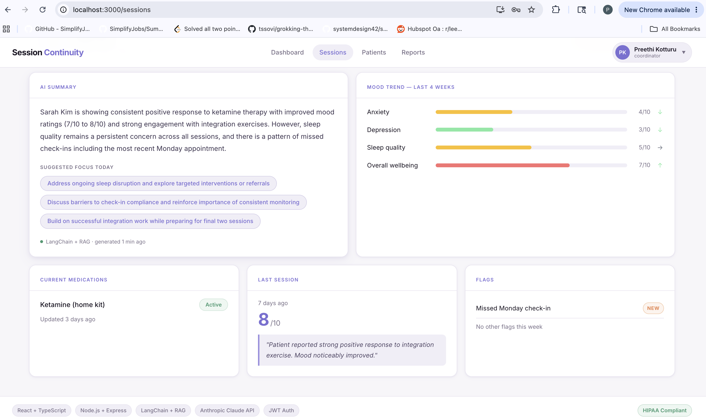

# Session Continuity Dashboard

> An AI-powered care coordinator dashboard built for **Better U** — giving coordinators a complete picture of each patient before every session starts.

**The coordinator walks in already knowing the patient. The patient feels that in the first 30 seconds.**

---

## Live Demo

🔗 **[View Live Dashboard](https://session-continuity-dashboard.vercel.app)**

**Demo login:**
```
Email:    preethi@betterucare.com
Password: demo123
```

---

## Screenshots

### Login


### Dashboard — Caseload Overview


### Sessions — AI Summary + Mood Trends


### AI-Generated Clinical Summary


### Patient List


### Reports & Analytics


### Profile Settings


### Notification Settings


---

## System Design

### High Level Architecture

```
┌──────────────────────────────────────────────────────────┐
│                        CLIENT                             │
│           React 18 + TypeScript + CSS Modules             │
│      React Router v6  ·  Axios  ·  JWT localStorage       │
└─────────────────────────┬────────────────────────────────┘
                          │  HTTPS · Authorization: Bearer <token>
                          ▼
┌──────────────────────────────────────────────────────────┐
│                      API LAYER                            │
│                  Node.js + Express                        │
│   JWT middleware  ·  Role-based access  ·  Helmet + CORS  │
└──────────┬───────────────────────────────────────────────┘
           │                          │
           ▼                          ▼
┌─────────────────┐       ┌───────────────────────────────┐
│   DATA STORE    │       │        RAG PIPELINE            │
│  (PostgreSQL    │       │         (LangChain.js)         │
│  in production) │       │                                │
│                 │       │  1. Session notes → Documents  │
│  · Patients     │       │  2. TF-IDF embeddings          │
│  · Sessions     │       │  3. Cosine similarity search   │
│  · Mood data    │       │  4. Top 3 docs retrieved       │
│  · Medications  │       │  5. RunnableSequence chain     │
│  · Flags        │       │  6. Claude generates summary   │
└─────────────────┘       └───────────────┬───────────────┘
                                          │
                                          ▼
                          ┌───────────────────────────────┐
                          │     Anthropic Claude API       │
                          │       claude-sonnet-4-5        │
                          └───────────────────────────────┘
```

### RAG Pipeline — How the AI Summary Works

```
  Patient Session History (4–6 notes)
              │
              ▼
  ┌─────────────────────────┐
  │   LangChain Documents   │  Each session note becomes a Document
  │   + Mood data doc       │  with metadata (session #, rating)
  └───────────┬─────────────┘
              │
              ▼
  ┌─────────────────────────┐
  │   TF-IDF Embeddings     │  Each document converted to
  │   (SimpleVectorStore)   │  a numerical vector
  └───────────┬─────────────┘
              │
              ▼
  ┌─────────────────────────┐
  │  Similarity Search      │  Query: "patient progress mood
  │  (cosine distance)      │  trends sleep issues flags"
  │                         │  → Top 3 most relevant docs
  └───────────┬─────────────┘
              │
              ▼
  ┌─────────────────────────┐
  │  LangChain              │  Retrieved context injected
  │  PromptTemplate         │  into clinical prompt
  │  + RunnableSequence     │
  └───────────┬─────────────┘
              │
              ▼
  ┌─────────────────────────┐
  │  Anthropic Claude       │  Generates:
  │  claude-sonnet-4-5      │  · 2-3 sentence summary
  │                         │  · 3 suggested focus areas
  └───────────┬─────────────┘
              │
              ▼
  ┌─────────────────────────┐
  │  In-memory cache        │  5 min TTL — coordinator
  │  (Redis in production)  │  never waits on repeat loads
  └─────────────────────────┘
```

### Authentication Flow

```
  Coordinator enters credentials
              │
              ▼
  POST /api/v1/auth/login
              │
              ▼
  bcrypt.compare(password, hash)
              │
              ▼
  jwt.sign({ id, email, role })  ← HS256, expires 8h
              │
              ▼
  Token stored in localStorage
              │
              ▼
  Axios interceptor attaches
  Authorization: Bearer <token>
  to every API request
              │
              ▼
  authenticate() middleware
  verifies token on every
  protected route
```

---

## How It Works

### For the Care Coordinator

1. **Sign in** with your credentials — JWT token issued, valid for 8 hours
2. **Dashboard** shows a live overview of your caseload — sessions today, active flags, program progress
3. **Sessions** tab — select any patient to see their full pre-session briefing:
   - **AI Summary** — generated by LangChain RAG pipeline, pulls the most clinically relevant session notes via semantic search and feeds them to Claude Sonnet
   - **Mood Trends** — anxiety, depression, sleep quality, and wellbeing tracked over 4 weeks with trend indicators
   - **Current Medications** — active prescriptions with status
   - **Last Session** — rating out of 10 and coordinator notes
   - **Active Flags** — anything requiring attention before the session starts
4. **Patients** tab — full list of your caseload with program and next session info
5. **Reports** tab — program-level metrics and outcomes
6. **Profile** — update your name and role, preferences persist across sessions
7. **Notifications** — toggle which alerts you receive
8. **Sign out** — JWT cleared from client, session ended

### For the Engineer

The AI summary uses a genuine **LangChain RAG pipeline**:

- Each patient's session history is chunked into `LangChain Document` objects
- Documents are embedded using a TF-IDF vector approach (production would use Anthropic `voyage-3` embeddings)
- Stored in a `SimpleVectorStore` with cosine similarity search
- At summary generation time, a semantic search finds the **3 most relevant** session notes — not just the most recent ones
- Retrieved documents are injected into a `PromptTemplate` and run through a `RunnableSequence` chain
- Claude Sonnet generates a clinical briefing: a 2-3 sentence summary and 3 suggested focus areas
- Result cached in-memory for 5 minutes (Redis in production)

---

## Tech Stack

| Layer | Technology |
|---|---|
| Frontend | React 18 + TypeScript |
| Routing | React Router v6 |
| HTTP | Axios with JWT interceptor |
| Styling | CSS Modules |
| Backend | Node.js + Express |
| AI / RAG | LangChain.js — RunnableSequence, PromptTemplate |
| LLM | Anthropic Claude (claude-sonnet-4-5) |
| Embeddings | TF-IDF local (voyage-3 in production) |
| Vector store | In-memory (pgvector + PostgreSQL in production) |
| Cache | In-memory Map (Redis in production) |
| Auth | JWT — jsonwebtoken + bcryptjs |
| Security | Helmet.js, CORS, role-based middleware |

---

## Project Structure

```
session-continuity-dashboard/
├── README.md
├── screenshots/
├── frontend/
│   └── src/
│       ├── api/
│       │   └── patientApi.ts          # Axios + JWT interceptor + auth
│       ├── components/
│       │   ├── layout/
│       │   │   ├── Navbar.tsx          # Nav + profile dropdown
│       │   │   └── Footer.tsx          # Tech stack pills
│       │   ├── dashboard/
│       │   │   ├── SessionDashboard.tsx    # Patient tabs
│       │   │   ├── PatientHeader.tsx       # Name + flag badge
│       │   │   ├── AISummaryCard.tsx       # RAG summary display
│       │   │   ├── MoodTrendCard.tsx       # Animated bars
│       │   │   ├── MedicationsCard.tsx
│       │   │   ├── LastSessionCard.tsx
│       │   │   └── FlagsCard.tsx
│       │   └── pages/
│       │       ├── DashboardPage.tsx       # Overview + stats
│       │       ├── PatientsPage.tsx        # Patient list
│       │       ├── ReportsPage.tsx         # Analytics
│       │       ├── ProfilePage.tsx         # Edit profile
│       │       ├── NotificationsPage.tsx   # Notification toggles
│       │       └── LoginPage.tsx           # JWT login
│       ├── hooks/
│       │   └── usePatient.ts
│       ├── types/
│       │   └── patient.ts
│       └── styles/
│           └── globals.css
└── backend/
    └── src/
        └── server.js                  # Express + LangChain + JWT
```

---

## Running Locally

### Prerequisites

- Node.js 18+
- Anthropic API key → [console.anthropic.com](https://console.anthropic.com)

### Backend

```bash
cd backend
npm install
```

Create `backend/.env`:

```
ANTHROPIC_API_KEY=sk-ant-your-key-here
PORT=3001
FRONTEND_URL=http://localhost:3000
JWT_SECRET=your-secret-here
```

```bash
npm run dev
# API at http://localhost:3001
```

### Frontend

```bash
cd frontend
npm install
npm start
# Dashboard at http://localhost:3000
```

---

## API Reference

| Method | Endpoint | Auth | Description |
|--------|----------|------|-------------|
| POST | `/api/v1/auth/login` | Public | Login → JWT token |
| POST | `/api/v1/auth/logout` | Public | Logout |
| GET | `/api/v1/auth/me` | JWT | Current user |
| GET | `/api/v1/patients` | JWT + coordinator | All patients |
| GET | `/api/v1/patients/:id/summary` | JWT + coordinator | Full summary + AI |
| GET | `/api/v1/patients/:id/mood` | JWT + coordinator | Mood trends |
| GET | `/api/v1/patients/:id/ai-summary` | JWT + coordinator | AI summary only |
| POST | `/api/v1/patients/:id/rebuild-index` | JWT + coordinator | Rebuild vector store |

---

## Security

- JWT tokens signed with HS256, expire in 8 hours
- Passwords hashed with bcrypt
- Role-based middleware on all patient routes
- Helmet.js security headers
- CORS restricted to known frontend origin
- Expired token automatically redirects to login

---

## Production Roadmap

| Current Demo | Production |
|---|---|
| In-memory patient data | PostgreSQL |
| TF-IDF embeddings | Anthropic voyage-3 + pgvector |
| In-memory cache | Redis — 5 min TTL |
| Single user | Full user management + RBAC |
| Simulated notifications | Email/SMS via AWS SES/SNS |
| Local deployment | AWS ECS + CloudFront |

---

*Built by **Preethi Kotturu** as a demonstration for Better U's engineering team.*